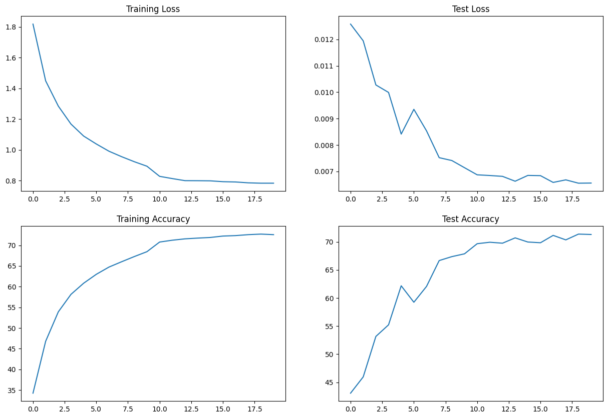
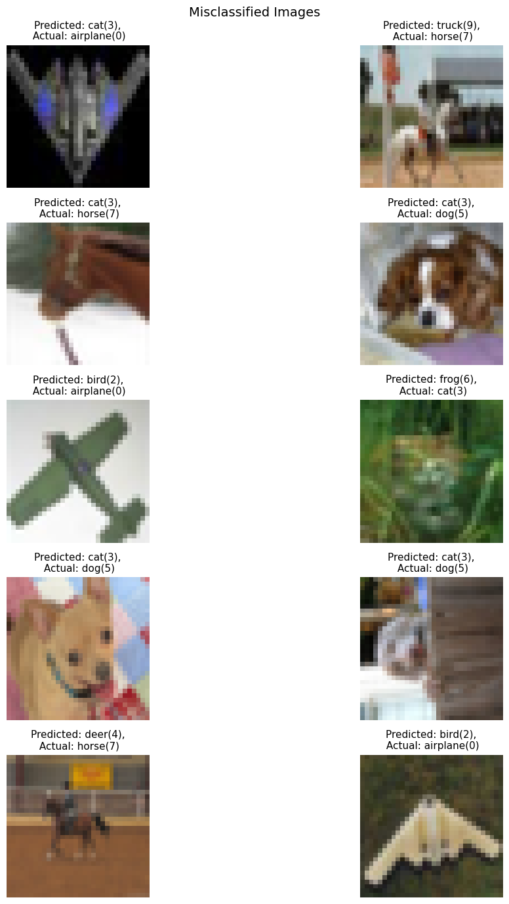

# Normalization 

This study focuses on different types of normalizations carried on convolutional neural networks (CNN). Following types of normalizations have been studied here:
 
- Network with Group Normalization
- Network with Layer Normalization
- Network with Batch Normalization

All the networks follow `C1 C2 c3 P1 C4 C5 C6 c7 P2 C8 C9 C10 GAP c11` pattern where `Ci` is convolution step with 3x3 kernel and `ci` is with 1x1 kernel. `Pi` indicates the max pooling and `GAP` as global average pooling.

# Group Normalization
### Overview
- Group normalization has been used where channels are divided into groups and normalization is carried out within each group separately.
- A group is just simply independent set of channels
- Total number of parameters should be less than 50000 and and minimum accuracy of 70% 

### Results:
- Total parameters: 40,248
- Best train accuracy: 74.83% at epoch 20
- Best test accuracy: 74.03% at epoch 19

#### Loss and Accuracy Plots

#### Misclassified Images in Test Data

### Analysis
- Accuracy of more than 70% can be easily achieved with fewer than 50000 parameters
- Dropout was required for this model to get rid of overfitting

# Layer Normalization
### Overview
- LayerNorm normalizes the features of each sample independently. It computes the mean and variance over all the elements in a layer for each sample.
- Usage of `nn.LayerNorm` leads to very large number of parameters and the limit of max number of parameters is 50000 currently
- Layer normalization has been implemented with the help of `nn.GroupNorm()` functionality by setting `num_groups=1, num_channels=size` parameters

### Results:
- Total parameters: 49,760
- Best train accuracy: 71.21% at epoch 20
- Best test accuracy: 72.78% at epoch 20

#### Loss and Accuracy Plots

#### Misclassified Images in Test Data

### Analysis
- Accuracy of more than 70% is achieved consistently towards final epochs with number of parameters slightly less than 50k
- More number of parameters are required for LayerNorm method compared to BatchNorm and GroupNorm to achieve same level of accuracy

# Batch Normalization
### Overview
- Batch Normalization aims to stabilize the learning process and improve convergence times by normalizing the inputs of each layer
- It can reduce internal covariate shift

### Results:
- Total parameters: 40,248
- Best train accuracy: 72.7% at epoch 20
- Best test accuracy: 71.38% at epoch 19

#### Loss and Accuracy Plots

#### Misclassified Images in Test Data

### Analysis
- Accuracy of more than 70% can be achieved with fewer than 50000 parameters
- Training accuracy is slightly better than test accuracy and it indicates overfitting. Increasing dropout value did not remove this aspect.

