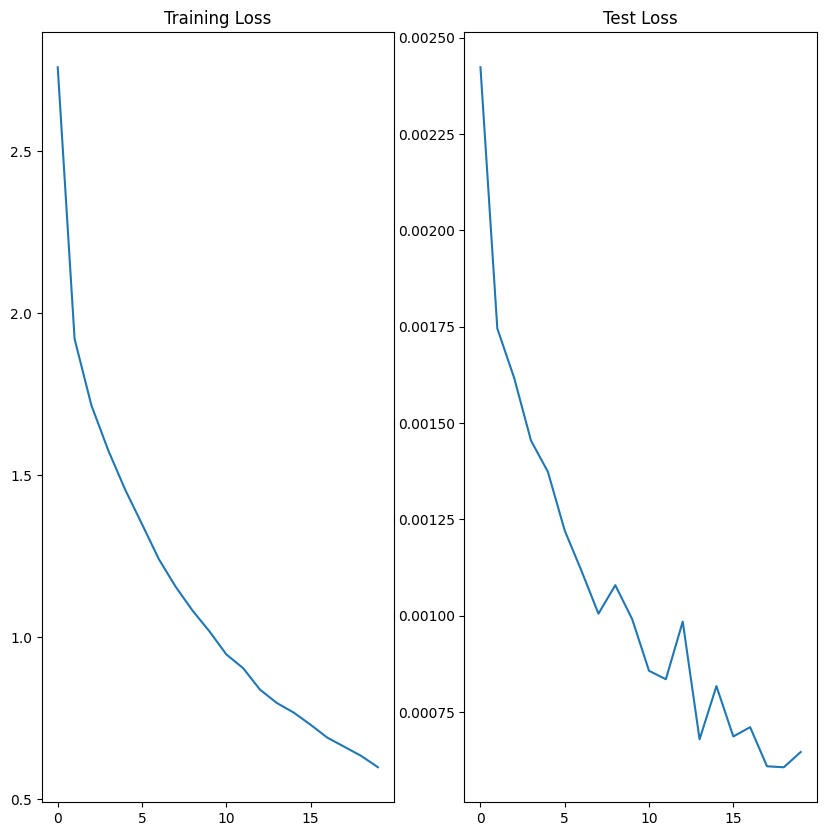
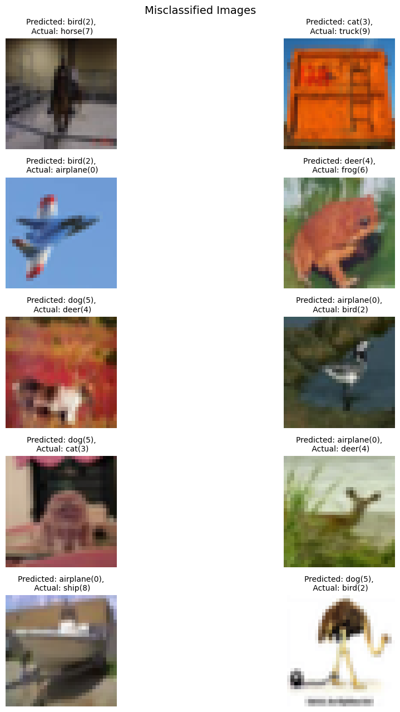

# CIFAR10 Image Classification with ResNet18
Clone the model repository and import model and utility functions.

The noebook contains minimum functionality to just import and train the model.
The loss variation and sample misclassified images are displayed below and within notebook as well.

#### Loss Plots

#### Misclassified Images in Test Data

