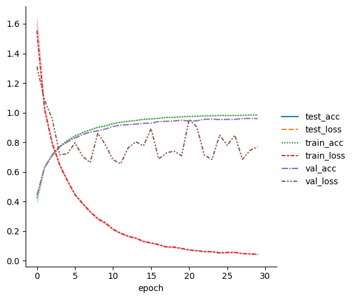

The training and testing code for CIFAR10 dataset has been converted into a small, efficient 
version using Pytorch-Lightning. 

### Log for training phase:
```
CUDA Available? True
Files already downloaded and verified
Files already downloaded and verified
INFO:pytorch_lightning.utilities.rank_zero:GPU available: True (cuda), used: True
INFO:pytorch_lightning.utilities.rank_zero:TPU available: False, using: 0 TPU cores
INFO:pytorch_lightning.utilities.rank_zero:IPU available: False, using: 0 IPUs
INFO:pytorch_lightning.utilities.rank_zero:HPU available: False, using: 0 HPUs
WARNING:lightning_fabric.loggers.csv_logs:Missing logger folder: logs/lightning_logs
INFO:pytorch_lightning.accelerators.cuda:LOCAL_RANK: 0 - CUDA_VISIBLE_DEVICES: [0]
INFO:pytorch_lightning.callbacks.model_summary:
  | Name     | Type               | Params
------------------------------------------------
0 | conv1    | Conv2d             | 1.7 K 
1 | bn1      | BatchNorm2d        | 128   
2 | layer1   | Sequential         | 147 K 
3 | layer2   | Sequential         | 525 K 
4 | layer3   | Sequential         | 2.1 M 
5 | layer4   | Sequential         | 8.4 M 
6 | linear   | Linear             | 5.1 K 
7 | accuracy | MulticlassAccuracy | 0     
------------------------------------------------
11.2 M    Trainable params
0         Non-trainable params
11.2 M    Total params
44.696    Total estimated model params size (MB)
Sanity Checking: |          | 0/? [00:00<?, ?it/s]
Files already downloaded and verified
/usr/local/lib/python3.10/dist-packages/pytorch_lightning/trainer/connectors/data_connector.py:492: Your `val_dataloader`'s sampler has shuffling enabled, it is strongly recommended that you turn shuffling off for val/test dataloaders.
Training: |          | 0/? [00:00<?, ?it/s]
Validation: |          | 0/? [00:00<?, ?it/s]
Validation: |          | 0/? [00:00<?, ?it/s]
.
.
Validation: |          | 0/? [00:00<?, ?it/s]
INFO:pytorch_lightning.utilities.rank_zero:`Trainer.fit` stopped: `max_epochs=30` reached.
```
### Log for testing phase:
```
/usr/local/lib/python3.10/dist-packages/pytorch_lightning/trainer/connectors/checkpoint_connector.py:145: `.test(ckpt_path=None)` was called without a model. The best model of the previous `fit` call will be used. You can pass `.test(ckpt_path='best')` to use the best model or `.test(ckpt_path='last')` to use the last model. If you pass a value, this warning will be silenced.
INFO:pytorch_lightning.utilities.rank_zero:Restoring states from the checkpoint path at logs/lightning_logs/version_0/checkpoints/epoch=29-step=1470.ckpt
INFO:pytorch_lightning.accelerators.cuda:LOCAL_RANK: 0 - CUDA_VISIBLE_DEVICES: [0]
INFO:pytorch_lightning.utilities.rank_zero:Loaded model weights from the checkpoint at logs/lightning_logs/version_0/checkpoints/epoch=29-step=1470.ckpt
Files already downloaded and verified
/usr/local/lib/python3.10/dist-packages/pytorch_lightning/trainer/connectors/data_connector.py:492: Your `test_dataloader`'s sampler has shuffling enabled, it is strongly recommended that you turn shuffling off for val/test dataloaders.
Testing: |          | 0/? [00:00<?, ?it/s]
┏━━━━━━━━━━━━━━━━━━━━━━━━━━━┳━━━━━━━━━━━━━━━━━━━━━━━━━━━┓
┃        Test metric        ┃       DataLoader 0        ┃
┡━━━━━━━━━━━━━━━━━━━━━━━━━━━╇━━━━━━━━━━━━━━━━━━━━━━━━━━━┩
│         test_acc          │    0.8312000036239624     │
│         test_loss         │    0.7691705226898193     │
└───────────────────────────┴───────────────────────────┘
[{'test_loss': 0.7691705226898193, 'test_acc': 0.8312000036239624}]
```

### Loss variation with epoch

