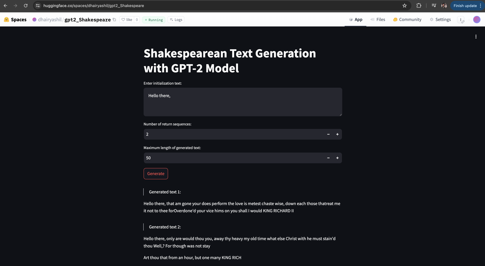

## GPT-2 training with Shakespeare text
The model with 124M parameters is trained further on the Shakespeare text to generate desired number of tokens 
based on the given input text. The app based on the customized text is provided on [HuggingFace App](https://huggingface.co/spaces/dhairyashil/gpt2_Shakespeare)

The model is trained on `device=mps`, hence the files contain appropriate parameters which are different from `cuda` or `cpu` parameters. 

### Training Log
The criterion `loss<0.09999` is achieved with around 1000 steps and the training log is provided [here](https://github.com/dhairyag/extensive_AI_reimagined_advanced/blob/main/session_21/log.txt)

### Sample Output 
The output generated after sample text is shown [here](https://github.com/dhairyag/extensive_AI_reimagined_advanced/blob/main/session_21/sample_output.txt)

### [HuggingFace App](https://huggingface.co/spaces/dhairyashil/gpt2_Shakespeare) Screenshot

